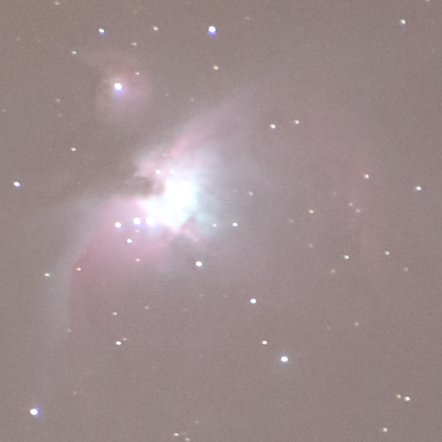

# kimage

Image processing using Kotlin scripts.

`kimage` is several things at once:

- `kimage` is an image processing library written in Kotlin
  
- `kimage` is a script execution engine for image processing scripts
  
- `kimage` is a collection of image processing scripts (mostly for astrophotography purposes)


# Example Usage

## List available scripts

Running `kimage` without any arguments will list the available scripts
(you might see more scripts if you have some local scripts installed):

```shell
kimage
```

```
Scripts:
  align
  calibrate
  color-stretch
  convert
  delta
  hdr
  histogram
  info
  remove-background-gradient
  remove-background-median
  stack
  stack-average
  stack-max
  test-multi
  test-single
```

Use the `--docu` option to get help on a single command:

```shell
kimage stack-max --docu
```

```
## Script: stack-max

    kimage [OPTIONS] stack-max
        [FILES]

Stacks multiple images by calculating a pixel-wise maximum.

This stacking script is useful to find outliers and badly aligned images.

---
```

Use the `--docu` option without a specific command and you get the documentation of all commands:

```shell
kimage --docu
```

The script documentation further below was generated this way. 


## Execute command line scripts

You can execute simple `kimage` scripts directly from the command line:

```shell
kimage 'inputImage.gaussianBlurFilter(5)' lena512.png
```


## Aligning and Stacking multiple images

Six images of M42 (Orion nebula) where taken using a 400mm tele lens in an area with Bortle 4 light pollution.

The images where cropped to show only the interesting part:



Here one of the unprocessed images:


---

Let's start by running a straightforward `stack-max` script that will show how badly aligned the images are.

```shell
  kimage stack-max orion*.png
```


---

To align the images against the base image (the first one in the list) we use the `align` script:

```shell
    kimage align orion*.png
```

The output will tell us by how many pixels each image was aligned and what the error distance to the base image is (smaller is better).
If an aligned image is above the error threshold it will be saved with a prefix `badaligned` instead.

```
Loading image: orion2.png
Alignment: Alignment(x=-8, y=-4, error=2.450572331451992E-4)
Error 4.567307562910387E-4 <= 0.001 : saving aligned_orion2.png
```


---

Let's run `stack-max` on the aligned images:

```shell
kimage stack-max orion*.png
```


The images are fairly well aligned, but we can see to the right of the center some stuck pixels.

The script `stack-max` should only be used to verify the quality of the aligned images.

---

For real stacking the script `stack` is slower but produces much better quality.

```shell
    kimage stack orion*.png
```

```
Stack multiple images

Arguments:
  method = sigma-clip-median
  kappa = 2.0
  iterations = 10

Loading image: aligned_orion1.png
Loading image: aligned_orion2.png
Loading image: aligned_orion3.png
Loading image: aligned_orion4.png
Loading image: aligned_orion5.png
Loading image: aligned_orion6.png

Stacking 6 images using sigma-clip-median
Stacking channel: Red
Stacking channel: Green
Stacking channel: Blue
Sigma-Clip Histogram
  0 :          0
  1 :          0
  2 :      11946
  3 :     101072 #####
  4 :     152128 ########
  5 :     343100 ###################
  6 :    1079254 ############################################################

Saving stack(sigma-clip-median)_aligned_orion1.png
```

The sigma-clip histogram shows how many pixel values (red, green, blue) where outliers and had to be rejected.

In this example for 1079254 pixel values all 6 samples from the aligned images where used,
whereas in 11946 cases only 2 samples where used (and 4 where rejected).

_aligned_orion1.png)

The output image is much smoother and does not show the stuck pixels anymore.

---

To remove the light pollution background we use `remove-background-gradient`.

```shell
kimage remove-background-gradient 'stack(sigma-clip-median)_aligned_orion1.png'
```

_aligned_orion1.png)

This script has calculated an interpolated background image and subtracted it from the original image.

---

But now the image is too dark. The `color-stretch` script can fix this.

```shell
kimage color-stretch 'remove-background-gradient_stack(sigma-clip-median)_aligned_orion1.png'
```

_remove-background-gradient_stack(sigma-clip-median)_aligned_orion1.png)

The color stretching algorithm has 2 arguments: `brightness` and `curve`.
After playing with the two arguments for a bit we find a pleasing combination:

```shell
kimage color-stretch --arg brightness=3 --arg curve=s-curve-strong 'remove-background-gradient_stack(sigma-clip-median)_aligned_orion1.png'
```

_remove-background-gradient_stack(sigma-clip-median)_aligned_orion1.png)

---


## Writing Scripts

It is possible to write your own `kimage` scripts.

Create a `.kimage` directory in your home directory and copy the following script into a file `.kimage/spooky.kts`:

```kotlin
import ch.obermuhlner.kimage.*
import ch.obermuhlner.kimage.align.*
import ch.obermuhlner.kimage.filter.*
import ch.obermuhlner.kimage.image.*
import ch.obermuhlner.kimage.io.*
import java.io.*
import kotlin.math.*

kimage(0.1) {
  name = "spooky"
  description = """
                Spooky cool effect.
                """

  single {
    println("Spooky cool effect")

    val background = inputImage.medianFilter(10).gaussianBlurFilter(10)
    inputImage - background
  }
}
```

`kimage` will now list the `spooky` script and even provide documentation for it:

```shell
kimage spooky --docu
```

```markdown
## Script: spooky

    kimage [OPTIONS] spooky
        [FILES]

Spooky cool effect.

---
```

```shell
kimage spooky lena512.png
```

```
Spooky cool effect
Output file: .\spooky_lena512.png
```


# Scripts

The following scripts are distributed together with the `kimage` application.

---

## Script: `align`

    kimage [OPTIONS] align
        [--arg checkRadius=INT]
        [--arg searchRadius=INT]
        [--arg centerX=INT]
        [--arg centerY=INT]
        [--arg errorThreshold=DOUBLE]
        [--arg prefix=STRING]
        [--arg saveBad=BOOLEAN]
        [--arg prefixBad=STRING]
        [FILES]

### Align multiple images

The base image is the first image argument.
The remaining image arguments are aligned to the base image by searching for a matching feature.

The feature to match is defined by the `centerX`/`centerY` coordinates in the base image and the `checkRadius`.
The `searchRadius` defines how far the matching feature is searched.

Use the --debug option to save intermediate images for manual analysis.

#### Argument: `checkRadius`

- Type: int
- Minimum value: 0

The radius to check for similarity.
The default value is calculated from the base image.

#### Argument: `searchRadius`

- Type: int
- Minimum value: 0

The search radius defining the maximum offset to align.
The default value is calculated from the base image.

#### Argument: `centerX`

- Type: int
- Minimum value: 0

The X coordinate of the center to check for alignment.
The default value is calculated from the base image.

#### Argument: `centerY`

- Type: int
- Minimum value: 0

The Y coordinate of the center to check for alignment.
The default value is calculated from the base image.

#### Argument: `errorThreshold`

- Type: double
- Minimum value: 0.0
- Default value: 0.001

The maximum error threshold for storing an aligned image.
Images with an error above the error threshold will be either ignored
or saved with a different prefix.
See `saveBad`, `prefixBad`.

#### Argument: `prefix`

- Type: string
- Default value: `aligned`

The prefix of the aligned output files.

#### Argument: `saveBad`

- Type: boolean

Controls whether badly aligned images are saved.

#### Argument: `prefixBad`

- Type: string
- Default value: `badaligned`

The prefix of the badly aligned output files.

---

## Script: `calibrate`

    kimage [OPTIONS] calibrate
        [--arg bias=IMAGE]
        [--arg dark=IMAGE]
        [--arg flat=IMAGE]
        [--arg darkflat=IMAGE]
        [FILES]

### Calibrate images using bias/dark/flat/darkflat images

The different calibration files are optional, specify only the calibration image you have.

### Creating Calibration Images

Create about 20-50 images of each calibration image type.

- `bias` images
  - camera with lens cap on
  - same ISO as for real pictures
  - fastest exposure time
- `flat` images
  - camera against homogeneous light source (e.g. t-shirt over lens against sky)
  - same objective + focus as for real pictures
  - same aperture as for real pictures
  - set exposure time so that histogram shows most pixels at ~50%
- `darkflat` images
  - camera with lens cap on
  - same objective + focus as for real pictures
  - same aperture as for real pictures
  - same exposure time as for `flat` images
- `dark` images
  - camera with lens cap on
  - same objective + focus as for real pictures
  - same aperture as for real pictures
  - same exposure time as for real pictures
  - same temperature as for real pictures
  - (usually take the dark pictures immediately after taking the real pictures)

Stack the `bias` images with:

    kimage stack --arg method=median bias*.TIF
The output will be your master `bias` image - rename it accordingly.

Calibrate all other images with the `bias` images and stack them.

For example the `flat` images:

    kimage calibrate --arg bias=master_bias.TIF flat*.TIF
    kimage stack --arg method=median calibrate_flat*.TIF

Do this for the `flat`, `darkflat` and `dark` images.
The outputs will be your master `flat`, `darkflat` and `dark` images - rename them accordingly.

Calibrate the real images:

    kimage calibrate --arg bias=master_bias.TIF --arg flat=master_flat.TIF --arg darkflat=master_darkflat.TIF --arg dark=master_dark.TIF light*.TIF

See: http://deepskystacker.free.fr/english/theory.htm

#### Argument: `bias`

- Type: image

The `bias` master calibration image.

This argument is optional.
If no `bias` image is specified it will not be used in the calibration process.

#### Argument: `dark`

- Type: image

The `dark` master calibration image.

This argument is optional.
If no `dark` image is specified it will not be used in the calibration process.

#### Argument: `flat`

- Type: image

The `flat` master calibration image.

This argument is optional.
If no `flat` image is specified it will not be used in the calibration process.

#### Argument: `darkflat`

- Type: image

The `darkflat` master calibration image.

This argument is optional.
If no `flat` image is specified it will not be used in the calibration process.

---

## Script: `color-stretch`

    kimage [OPTIONS] color-stretch
        [--arg brightness=DOUBLE]
        [--arg curve=STRING]
        [--arg custom1X=DOUBLE]
        [--arg custom1Y=DOUBLE]
        [--arg custom2X=DOUBLE]
        [--arg custom2Y=DOUBLE]
        [FILES]

### Stretch the colors of an image to fill the entire value range

The colors are first brightened and then a curve is applied.

#### Argument: `brightness`

- Type: double
- Minimum value: 0.0
- Default value: 2.0

The power value of the brightness increase.

- A power value > 1 increases the brightness.
- A power value = 0 does not change the brightness.
- A power value < 1 increases the brightness.

#### Argument: `curve`

- Type: string
- Allowed values:
  - `linear`
  - `s-curve`
  - `s-curve-bright`
  - `s-curve-dark`
  - `s-curve-strong`
  - `s-curve-super-strong`
  - `bright+`
  - `dark+`
  - `bright-`
  - `dark-`
  - `custom1`
  - `custom2`
  - `all`
- Default value: `s-curve`

The curve shape used to modify the contrast.

#### Argument: `custom1X`

- Type: double
- Default value: 0.2

#### Argument: `custom1Y`

- Type: double
- Default value: 0.1

#### Argument: `custom2X`

- Type: double
- Default value: 0.8

#### Argument: `custom2Y`

- Type: double
- Default value: 0.9

---

## Script: `delta`

    kimage [OPTIONS] delta
        [--arg factor=DOUBLE]
        [--arg channel=STRING]
        [FILES]

### Create delta images between the first image and all other images

The output images show the pixel-wise difference between two images on a specific channel (default is `Luminance`).

The difference is color coded:
  - black = no difference
  - blue  = pixel in the first image is brighter
  - red   = pixel in the first image is darker

The `factor` argument controls how much the differences are exaggerated.

This script is a useful to compare images, especially outputs of other scripts with different arguments.

#### Argument: `factor`

- Type: double
- Default value: 5.0

Controls how much the differences are exaggerated.

#### Argument: `channel`

- Type: string
- Allowed values:
  - `Red`
  - `Green`
  - `Blue`
  - `Luminance`
  - `Gray`
- Default value: `Luminance`

The channel used to calculate the difference between two images.

---

## Script: `hdr`

    kimage [OPTIONS] hdr
        [--arg saturationBlurRadius=INT]
        [--arg contrastWeight=DOUBLE]
        [--arg saturationWeight=DOUBLE]
        [--arg exposureWeight=DOUBLE]
        [FILES]

### Stack multiple images with different exposures into a single HDR image

Calculates for every pixel the values with the best exposure and merges them into a single HDR image.

#### Argument: `saturationBlurRadius`

- Type: int
- Default value: 3

#### Argument: `contrastWeight`

- Type: double
- Default value: 0.2

#### Argument: `saturationWeight`

- Type: double
- Default value: 0.1

#### Argument: `exposureWeight`

- Type: double
- Default value: 1.0

---

## Script: `histogram`

    kimage [OPTIONS] histogram
        [--arg width=INT]
        [--arg height=INT]
        [FILES]

### Create a histogram image

The values of every channel (RGB) are counted and a histogram is created for each channel.

#### Argument: `width`

- Type: int
- Default value: 512

The width of the histogram.

#### Argument: `height`

- Type: int
- Default value: 300

The height of the histogram.

---

## Script: `info`

    kimage [OPTIONS] info
        [FILES]

### Print info about images

---

## Script: `remove-background-gradient`

    kimage [OPTIONS] remove-background-gradient
        [--arg removePercent=DOUBLE]
        [--arg gridSize=INT]
        [--arg kappa=DOUBLE]
        [FILES]

### Remove the background by subtracting an interpolated gradient

Calculates an interpolated background image from several fix points and removes it.

This script is useful for astrophotography if the fix points are chosen to represent the background.

Use the --debug option to save intermediate images for manual analysis.

#### Argument: `removePercent`

- Type: double
- Default value: 100.0

The percentage of the calculated background that will be removed.

#### Argument: `gridSize`

- Type: int
- Default value: 5

The size of the grid in the x and y axis.
The number of grid points is the square of the `gridSize`.

#### Argument: `kappa`

- Type: double
- Default value: 0.5

The kappa factor is used in sigma-clipping of the grid to ignore grid points that do not contain enough background.

---

## Script: `remove-background-median`

    kimage [OPTIONS] remove-background-median
        [--arg removePercent=DOUBLE]
        [--arg medianFilterPercent=DOUBLE]
        [--arg blurFilterPercent=DOUBLE]
        [--arg medianFilterSize=INT]
        [--arg blurFilterSize=INT]
        [FILES]

### Remove the background by subtracting a blurred median-filtered version of the input

This script is useful for astrophotography if the image contains mainly stars and not too much nebulas.

The size of the median filter can be increased to remove stars and nebulas completely.

Use the --debug option to save intermediate images for manual analysis.

#### Argument: `removePercent`

- Type: double
- Default value: 99.0

The percentage of the calculated background that will be removed.

#### Argument: `medianFilterPercent`

- Type: double
- Default value: 0.0

The size of the median filter in percent of the image size.

#### Argument: `blurFilterPercent`

- Type: double
- Default value: 0.0

The size of the blur filter in percent of the image size.

#### Argument: `medianFilterSize`

- Type: int
- Default value: 0

The size of the median filter in pixels.
If this value is 0 then the `medianFilterPercent` is used to calculate it.
If the `medianFilterPercent` is 0.0 then the median filter size is calculated automatically from the image size.

#### Argument: `blurFilterSize`

- Type: int
- Default value: 0

The size of the blur filter in pixels.
If this value is 0 then the `blurFilterPercent` is used to calculate it.
If the `blurFilterPercent` is 0.0 then the blur filter size is calculated automatically from the image size.

---

## Script: `stack`

    kimage [OPTIONS] stack
        [--arg method=STRING]
        [--arg kappa=DOUBLE]
        [--arg iterations=INT]
        [FILES]

### Stack multiple image using one of several algorithms

After loading all images one of the following stacking methods is applied on the RGB channels:

- `median` takes the median values of every pixel of each input image.
- `average` takes the average values of every pixel of each input image.
- `max` takes the maximum value of every pixel of each input image.
- `min` takes the minimum value of every pixel of each input image.
- `sigma-clip-median` removes outliers before using `median` on the remaining values.
- `sigma-clip-average` removes outliers before using `average` on the remaining values.
- `sigma-winsorize-median` replaces outliers with the nearest value in sigma range before using `median`.
- `sigma-winsorize-average` replaces outliers with the nearest value in sigma range before using `average`.
- `winsorized-sigma-clip-median` replaces outliers with the nearest value in sigma range before sigma-clipping and then using `median`.
- `winsorized-sigma-clip-average` replaces outliers with the nearest value in sigma range before sigma-clipping and then using `average`.
- `all` runs all of the available methods and produces an output image for each method.

All methods that use sigma-clipping print a histogram with the information how many input values where actually used to stack each output value.

#### Argument: `method`

- Type: string
- Allowed values:
  - `median`
  - `average`
  - `max`
  - `min`
  - `sigma-clip-median`
  - `sigma-clip-average`
  - `sigma-winsorize-median`
  - `sigma-winsorize-average`
  - `winsorized-sigma-clip-median`
  - `winsorized-sigma-clip-average`
  - `all`
- Default value: `sigma-clip-median`

Method used to calculate the stacked image.

#### Argument: `kappa`

- Type: double
- Minimum value: 0.0
- Default value: 2.0

The kappa factor is used in sigma-clipping to define how far from the center the outliers are allowed to be.

#### Argument: `iterations`

- Type: int
- Minimum value: 0
- Default value: 10

The number of iterations used in sigma-clipping to remove outliers.

---

## Script: `stack-average`

    kimage [OPTIONS] stack-average
        [FILES]

### Stack multiple images by calculating a pixel-wise average

This stacking script is useful if there are no outliers and if the more powerful `stack` script fails for technical reasons.
This implementation is faster and uses less memory than using the generic script `stack --arg method=average`.

---

## Script: `stack-max`

    kimage [OPTIONS] stack-max
        [FILES]

### Stack multiple images by calculating a pixel-wise maximum

This stacking script is useful to find outliers and badly aligned images.
This implementation is faster and uses less memory than using the generic script `stack --arg method=max`.

---

## Script: `test-multi`

    kimage [OPTIONS] test-multi
        [--arg intArg=INT]
        [--arg optionalIntArg=INT]
        [--arg doubleArg=DOUBLE]
        [--arg booleanArg=BOOLEAN]
        [--arg stringArg=STRING]
        [--arg allowedStringArg=STRING]
        [--arg regexStringArg=STRING]
        [FILES]

### Test script to show how to handle multiple images in a kimage script

Example script as starting point for developers.

#### Argument: `intArg`

- Type: int
- Minimum value: 0
- Maximum value: 100
- Default value: 0

Example argument for an int value.

#### Argument: `optionalIntArg`

- Type: int
- Minimum value: 0
- Maximum value: 100

Example argument for an optional int value.

#### Argument: `doubleArg`

- Type: double
- Minimum value: 0.0
- Maximum value: 100.0
- Default value: 50.0

Example argument for a double value.

#### Argument: `booleanArg`

- Type: boolean

Example argument for a boolean value.

#### Argument: `stringArg`

- Type: string
- Default value: `undefined`

Example argument for a string value.

#### Argument: `allowedStringArg`

- Type: string
- Allowed values:
  - `red`
  - `green`
  - `blue`
- Default value: `red`

Example argument for a string value with some allowed strings.

#### Argument: `regexStringArg`

- Type: string
- Must match regular expression: `a+`
- Default value: `aaa`

Example argument for a string value with regular expression.

---

## Script: `test-single`

    kimage [OPTIONS] test-single
        [--arg intArg=INT]
        [--arg optionalIntArg=INT]
        [--arg doubleArg=DOUBLE]
        [--arg booleanArg=BOOLEAN]
        [--arg stringArg=STRING]
        [--arg allowedStringArg=STRING]
        [--arg regexStringArg=STRING]
        [FILES]

### Test script to show how to handle single images in a kimage script

Example script as starting point for developers.

#### Argument: `intArg`

- Type: int
- Minimum value: 0
- Maximum value: 100
- Default value: 0

Example argument for an int value.

#### Argument: `optionalIntArg`

- Type: int
- Minimum value: 0
- Maximum value: 100

Example argument for an optional int value.

#### Argument: `doubleArg`

- Type: double
- Minimum value: 0.0
- Maximum value: 100.0
- Default value: 50.0

Example argument for a double value.

#### Argument: `booleanArg`

- Type: boolean

Example argument for a boolean value.

#### Argument: `stringArg`

- Type: string
- Default value: `undefined`

Example argument for a string value.

#### Argument: `allowedStringArg`

- Type: string
- Allowed values:
  - `red`
  - `green`
  - `blue`
- Default value: `red`

Example argument for a string value with some allowed strings.

#### Argument: `regexStringArg`

- Type: string
- Must match regular expression: `a+`
- Default value: `aaa`

Example argument for a string value with regular expression.

---

