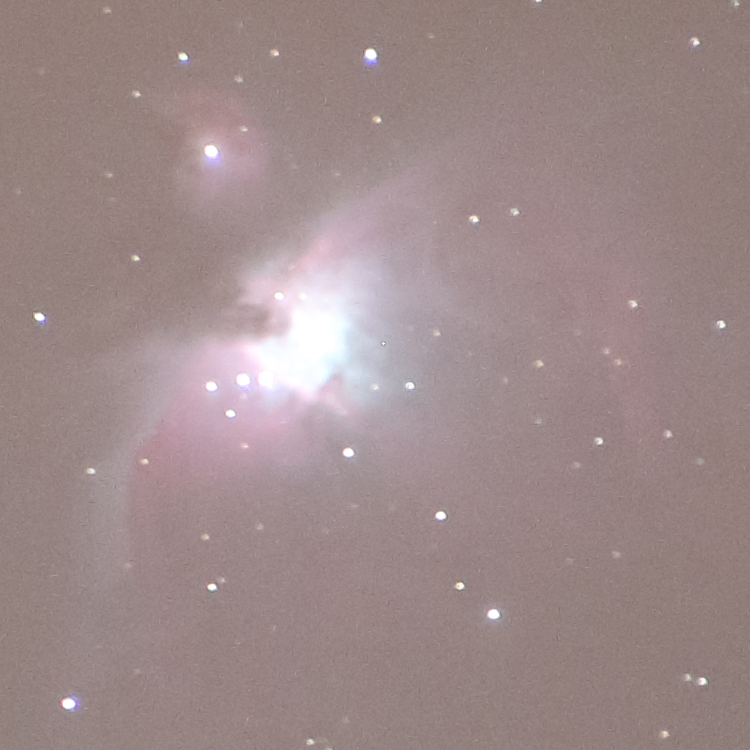
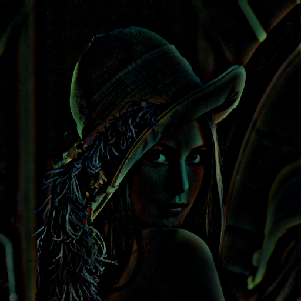

# kimage

Image processing using Kotlin scripts.

`kimage` is several things at once:

- `kimage` is an image processing library written in Kotlin

- `kimage` is a command-line script execution engine for image processing scripts

- `kimage` is a UI application to process images

- `kimage` is a collection of image processing scripts (mostly for astrophotography purposes)

# Example Usage - User Interface

The user interface can be started with

```
kimage --ui
```


On the left side you define the input files to be processed.

In the center you select the script to execute and edit the script arguments.

On the right side you verify the output files.

---

In the "Input Files" area you can add new images by pressing the "Add Input Files" button:


Click on a file name to see a preview of the image.

---

Select a script in the list of available scripts and the argument editor and the documentation of the script are shown.


After editing the arguments you run the script by pressing the Run button.


The "Log" tab shows the output of the script.


---

The output files of the script are written into the directory shown in the "Output Files" on the right side.


The directory is either automatically the same as the input directory or you pick your own directory.


- Use input directory as output directory
- Select the output directory for processed image files
- Go to parent directory
- Hide already existing files and show only newly added output files

Click on a file name to see a preview of the image.

---

Clicking inside one of the image views will show the "Image Zoom" tab where the clicked location will be shown.


The center of the "Image Zoom" tab shows the difference between the input and output zoom images.

The differences are color coded:
- Blue = the pixel on the left side is brighter
- Red  = the pixel on the right side is brighter

The slider controls how much the differences are exaggerated.


# Example Usage - Command Line

## List available scripts

Running `kimage` without any arguments will list the available scripts
(you might see more scripts if you have some local scripts installed):

```shell
kimage
```

```
Scripts:
  align
  calibrate
  color-stretch
  convert
  crop
  delta
  filter
  hdr
  histogram
  info
  remove-background-gradient
  remove-background-median
  remove-vignette
  resize
  stack
  stack-average
  stack-max
  test-multi
  test-single
```

Use the `--docu` option to get help on a single command:

```shell
kimage stack-max --docu
```

```
## Script: stack-max

    kimage [OPTIONS] stack-max
        [FILES]

Stacks multiple images by calculating a pixel-wise maximum.

This stacking script is useful to find outliers and badly aligned images.

---
```

Use the `--docu` option without a specific command and you get the documentation of all commands:

```shell
kimage --docu
```

The script documentation further below was generated this way. 


## Execute command line scripts

You can execute simple `kimage` scripts directly from the command line:

```shell
kimage 'inputImage.gaussianBlurFilter(5)' lena512.png
```


## Aligning and Stacking multiple images

Six images of M42 (Orion nebula) where taken using a 400mm tele lens in an area with Bortle 4 light pollution.

The images where cropped to show only the interesting part:



Here one of the unprocessed images:


---

Let's start by running a straightforward `stack-max` script that will show how badly aligned the images are.

```shell
  kimage stack-max orion*.png
```


---

To align the images against the base image (the first one in the list) we use the `align` script:

```shell
    kimage align orion*.png
```

The output will tell us by how many pixels each image was aligned and what the error distance to the base image is (smaller is better).
If an aligned image is above the error threshold it will be saved with a prefix `badaligned` instead.

This is an example of the log output for one of the images:
```
Loading image: orion2.png
Alignment: Alignment(x=-8, y=-4, error=2.450572331451992E-4)
Error 4.567307562910387E-4 <= 0.001 : saving aligned_orion2.png
```

Clicking through the output files (prefixed with `aligned_`) will show that the images are now aligned and the stars no longer jump around.


---

Let's run `stack-max` on the aligned images:

```shell
kimage stack-max orion*.png
```


The images are fairly well aligned, but we can see to the right of the center some stuck pixels.

The script `stack-max` should only be used to verify the quality of the aligned images.

---

For real stacking the script `stack` is slower but produces much better quality.

```shell
    kimage stack orion*.png
```

```
Stack multiple images

Arguments:
  method = sigma-clip-median
  kappa = 2.0
  iterations = 10

Loading image: aligned_orion1.png
Loading image: aligned_orion2.png
Loading image: aligned_orion3.png
Loading image: aligned_orion4.png
Loading image: aligned_orion5.png
Loading image: aligned_orion6.png

Stacking 6 images using sigma-clip-median
Stacking channel: Red
Stacking channel: Green
Stacking channel: Blue
Sigma-Clip Histogram
  0 :          0
  1 :          0
  2 :      11946
  3 :     101072 #####
  4 :     152128 ########
  5 :     343100 ###################
  6 :    1079254 ############################################################

Saving stack(sigma-clip-median)_aligned_orion1.png
```

The sigma-clip histogram shows how many pixel values (red, green, blue) where outliers and had to be rejected.

In this example for 1079254 pixel values all 6 samples from the aligned images where used,
whereas in 11946 cases only 2 samples where used (and 4 where rejected).

_aligned_orion1.png)

The output image is much smoother and does not show the stuck pixels anymore.

---

To remove the light pollution background we use `remove-background-gradient`.

```shell
kimage remove-background-gradient 'stack(sigma-clip-median)_aligned_orion1.png'
```

_aligned_orion1.png)

This script has calculated an interpolated background image and subtracted it from the original image.

---

But now the image is too dark. The `color-stretch` script can fix this.

```shell
kimage color-stretch 'remove-background-gradient_stack(sigma-clip-median)_aligned_orion1.png'
```

_remove-background-gradient_stack(sigma-clip-median)_aligned_orion1.png)

The color stretching algorithm has 2 arguments: `brightness` and `curve`.
After playing with the two arguments for a bit we find a pleasing combination:

```shell
kimage color-stretch --arg brightness=3 --arg curve=s-curve-strong 'remove-background-gradient_stack(sigma-clip-median)_aligned_orion1.png'
```

_remove-background-gradient_stack(sigma-clip-median)_aligned_orion1.png)

---

The image is still very noisy.

Since we do not have more images to stack we can only use a median filter to reduce the noise.

```shell
kimage filter --arg filter=median --arg radius=2 'color-stretch(3.0,s-curve-super-strong)_remove-background-gradi
ent_stack(sigma-clip-median)_aligned_orion1.png'
```

_remove-background-gradient_stack(sigma-clip-median)_aligned_orion1.png)


---


## Writing Scripts

It is possible to write your own `kimage` scripts.

Create a `.kimage` directory in your home directory and copy the following script into a file `.kimage/spooky.kts`:

```kotlin
import ch.obermuhlner.kimage.*
import ch.obermuhlner.kimage.align.*
import ch.obermuhlner.kimage.filter.*
import ch.obermuhlner.kimage.image.*
import ch.obermuhlner.kimage.io.*
import java.io.*
import kotlin.math.*

kimage(0.1) {
  name = "spooky"
  description = """
                Spooky cool effect.
                """

  single {
    val background = inputImage.medianFilter(10).gaussianBlurFilter(10)
    inputImage - background
  }
}
```

`kimage` will now list the `spooky` script and even provide documentation for it:

```shell
kimage spooky --docu
```

```markdown
## Script: spooky

    kimage [OPTIONS] spooky
        [FILES]

Spooky cool effect.

---
```

Let's run our script with an image.
```shell
kimage spooky lena512.png
```

```
Spooky cool effect
Output file: .\spooky_lena512.png
```



If you are interested in writing your own scripts - have a look at the 
[`test-single`](src/main/dist/.kimage/test-single.kts) and [`test-multi`](src/main/dist/.kimage/test-multi.kts) scripts distributed with `kimage`.


# Scripts

The following scripts are distributed together with the `kimage` application.

## Script: `align`

    kimage [OPTIONS] align
        [--arg checkRadius=INT]
        [--arg searchRadius=INT]
        [--arg centerX=INT]
        [--arg centerY=INT]
        [--arg errorThreshold=DOUBLE]
        [--arg prefix=STRING]
        [--arg saveBad=BOOLEAN]
        [--arg prefixBad=STRING]
        [FILES]

### Align multiple images

The base image is the first image argument.
The remaining image arguments are aligned to the base image by searching for a matching feature.

The feature to match is defined by the `centerX`/`centerY` coordinates in the base image and the `checkRadius`.
The `searchRadius` defines how far the matching feature is searched.

Use the --debug option to save intermediate images for manual analysis.

#### Argument: `checkRadius`

- Type: int
- Minimum value: 0

The radius to check for similarity.
The default value is calculated from the base image.

#### Argument: `searchRadius`

- Type: int
- Minimum value: 0

The search radius defining the maximum offset to align.
The default value is calculated from the base image.

#### Argument: `centerX`

- Type: int
- Minimum value: 0

The X coordinate of the center to check for alignment.
The default value is calculated from the base image.

#### Argument: `centerY`

- Type: int
- Minimum value: 0

The Y coordinate of the center to check for alignment.
The default value is calculated from the base image.

#### Argument: `errorThreshold`

- Type: double
- Minimum value: 0.0
- Default value: 0.001

The maximum error threshold for storing an aligned image.
Images with an error above the error threshold will be either ignored
or saved with a different prefix.
See `saveBad`, `prefixBad`.

#### Argument: `prefix`

- Type: string
- Default value: `aligned`

The prefix of the aligned output files.

#### Argument: `saveBad`

- Type: boolean

Controls whether badly aligned images are saved.

#### Argument: `prefixBad`

- Type: string
- Default value: `badaligned`

The prefix of the badly aligned output files.

---

## Script: `calibrate`

    kimage [OPTIONS] calibrate
        [--arg bias=IMAGE]
        [--arg dark=IMAGE]
        [--arg flat=IMAGE]
        [--arg darkflat=IMAGE]
        [FILES]

### Calibrate images using bias/dark/flat/darkflat images

The different calibration files are optional, specify only the calibration image you have.

### Creating Calibration Images

Create about 20-50 images of each calibration image type.

- `bias` images
  - camera with lens cap on
  - same ISO as for real pictures
  - fastest exposure time
- `flat` images
  - camera against homogeneous light source (e.g. t-shirt over lens against sky)
  - same objective + focus as for real pictures
  - same aperture as for real pictures
  - set exposure time so that histogram shows most pixels at ~50%
- `darkflat` images
  - camera with lens cap on
  - same objective + focus as for real pictures
  - same aperture as for real pictures
  - same exposure time as for `flat` images
- `dark` images
  - camera with lens cap on
  - same objective + focus as for real pictures
  - same aperture as for real pictures
  - same exposure time as for real pictures
  - same temperature as for real pictures
  - (usually take the dark pictures immediately after taking the real pictures)

Stack the `bias` images with:

    kimage stack --arg method=median bias*.TIF
The output will be your master `bias` image - rename it accordingly.

Calibrate all other images with the `bias` images and stack them.

For example the `flat` images:

    kimage calibrate --arg bias=master_bias.TIF flat*.TIF
    kimage stack --arg method=median calibrate_flat*.TIF

Do this for the `flat`, `darkflat` and `dark` images.
The outputs will be your master `flat`, `darkflat` and `dark` images - rename them accordingly.

Calibrate the real images:

    kimage calibrate --arg bias=master_bias.TIF --arg flat=master_flat.TIF --arg darkflat=master_darkflat.TIF --arg dark=master_dark.TIF light*.TIF

See: http://deepskystacker.free.fr/english/theory.htm

#### Argument: `bias`

- Type: image

The `bias` master calibration image.

This argument is optional.
If no `bias` image is specified it will not be used in the calibration process.

#### Argument: `dark`

- Type: image

The `dark` master calibration image.

This argument is optional.
If no `dark` image is specified it will not be used in the calibration process.

#### Argument: `flat`

- Type: image

The `flat` master calibration image.

This argument is optional.
If no `flat` image is specified it will not be used in the calibration process.

#### Argument: `darkflat`

- Type: image

The `darkflat` master calibration image.

This argument is optional.
If no `flat` image is specified it will not be used in the calibration process.

---

## Script: `color-stretch-curve`

    kimage [OPTIONS] color-stretch-curve
        [--arg brightness=DOUBLE]
        [--arg curve=STRING]
        [--arg custom1X=DOUBLE]
        [--arg custom1Y=DOUBLE]
        [--arg custom2X=DOUBLE]
        [--arg custom2Y=DOUBLE]
        [FILES]

### Stretch the colors non-linearly to fill the entire value range

The colors are first brightened using a power function and then a curve is applied.

The idea for this script is based on https://clarkvision.com/articles/astrophotography-rnc-color-stretch/

#### Argument: `brightness`

- Type: double
- Minimum value: 0.0
- Default value: 2.0

The power value of the brightness increase.

- A power value > 1 increases the brightness.
- A power value = 0 does not change the brightness.
- A power value < 1 increases the brightness.

#### Argument: `curve`

- Type: string
- Allowed values:
  - `linear`
  - `s-curve`
  - `s-curve-bright`
  - `s-curve-dark`
  - `s-curve-strong`
  - `s-curve-super-strong`
  - `bright+`
  - `dark+`
  - `bright-`
  - `dark-`
  - `custom1`
  - `custom2`
  - `all`
- Default value: `s-curve`

The curve shape used to modify the contrast.

#### Argument: `custom1X`

- Type: double
- Default value: 0.3

First X value in the custom curve.

#### Argument: `custom1Y`

- Type: double
- Default value: 0.01

First Y value in the custom curve.

#### Argument: `custom2X`

- Type: double
- Default value: 0.7

Second X value in the custom curve.

#### Argument: `custom2Y`

- Type: double
- Default value: 0.99

Second Y value in the custom curve.

---

## Script: `color-stretch-linear`

    kimage [OPTIONS] color-stretch-linear
        [--arg low=DOUBLE]
        [--arg high=DOUBLE]
        [--arg channel=STRING]
        [FILES]

### Linear stretching of colors

Stretch the pixel values linearly so that the entire color range is used.

#### Argument: `low`

- Type: double
- Default value: 0.1

Low percentile that will be stretched to 0.
Values below this percentile will be clipped at 1.

#### Argument: `high`

- Type: double
- Default value: 99.9

High percentile that will be stretched to 1.
Values above this percentile will be clipped at 1.

#### Argument: `channel`

- Type: string
- Allowed values:
  - `RGB`
  - `Red`
  - `Green`
  - `Blue`
  - `Luminance`
  - `Gray`
- Default value: `RGB`

Channel used to measure the values to be stretched.

---

## Script: `convert`

    kimage [OPTIONS] convert
        [--arg replaceExtension=BOOLEAN]
        --arg extension=STRING
        [FILES]

### Convert an image

Convert an image into another format.

#### Argument: `replaceExtension`

- Type: boolean

Controls whether the old extension should be replaced with the new extension.

- true :  Input file `example.png` would be saved as `example.tif`.
- false : Input file `example.png` would be saved as `example.png.tif`.

#### Argument: `extension`

- Type: string
- Mandatory: yes
- Allowed values:
  - `bmp`
  - `fit`
  - `fits`
  - `gif`
  - `jpeg`
  - `jpg`
  - `png`
  - `tif`
  - `tiff`
  - `wbmp`

The extension to save the converted image file.

---

## Script: `convert-raw`

    kimage [OPTIONS] convert-raw
        [--arg dcraw=STRING]
        [--arg rotate=STRING]
        [--arg aspectRatio=BOOLEAN]
        [--arg whitebalance=STRING]
        [--arg multipliers=LIST]
        [--arg colorspace=STRING]
        [--arg interpolation=STRING]
        [--arg medianPasses=INT]
        [--arg bits=STRING]
        [--arg brightness=DOUBLE]
        [FILES]

### Convert an image from raw format into tiff

Convert an image from raw format into tiff.

#### Argument: `dcraw`

- Type: string
- Default value: `dcraw`

The `dcraw` executable.

If the executable is not in the `PATH` then the absolute path is required to run it.

#### Argument: `rotate`

- Type: string
- Allowed values:
  - `0`
  - `90`
  - `180`
  - `270`
  - `auto`
- Default value: `auto`

The angle to rotate the image.
- `auto` will use the information in the image rotate.

This corresponds to the `-t` option in the `dcraw` command line tool.

#### Argument: `aspectRatio`

- Type: boolean


This corresponds to the `-j` option in the `dcraw` command line tool.

#### Argument: `whitebalance`

- Type: string
- Allowed values:
  - `camera`
  - `image`
  - `custom`
  - `fixed`
- Default value: `camera`

The whitebalance setting used to adjust the colors.

- `camera` will use the whitebalance settings measured by the camera (if available)
- `image` will calculate the whitebalance from the image
- `custom` will use the provided custom multipliers
- `fixed` will use fixed default white balance multipliers.

The `camera` whitebalance corresponds to the `-w` option in the `dcraw` command line tool.
The `image` whitebalance corresponds to the `-a` option in the `dcraw` command line tool.
The `custom` whitebalance corresponds to the `-r` option in the `dcraw` command line tool.
The `fixed` whitebalance corresponds to the `-W` option in the `dcraw` command line tool.

#### Argument: `multipliers`

- Type: list
- List Elements:
  - Type: double

- Minimum length: 4
- Maximum length: 4

The four multipliers used for `custom` whitebalance mode.

Corresponds to the `-r` option in the `dcraw` command line tool.

#### Argument: `colorspace`

- Type: string
- Allowed values:
  - `raw`
  - `sRGB`
  - `AdobeRGB`
  - `WideGamutRGB`
  - `KodakProPhotoRGB`
  - `XYZ`
  - `ACES`
  - `embed`
- Default value: `sRGB`

The colorspace to be used for the output image.

#### Argument: `interpolation`

- Type: string
- Allowed values:
  - `bilinear`
  - `VNG`
  - `PPG`
  - `AHD`
  - `none`
  - `none-unscaled`
  - `none-uncropped`
- Default value: `AHD`

The demosaicing interpolation method to use.

- `bilinear`: Bilinear interpolation between neighboring pixels of the same color.

  Corresponds to the `-q 0` option in the `dcraw` command line tool.
- `VNG`: Variable Number Gradients

  Corresponds to the `-q 1` option in the `dcraw` command line tool.
- `PPG`: Patterned Pixel Grouping

  Corresponds to the `-q 2` option in the `dcraw` command line tool.
- `AHD`: Adaptive Homogeneity Directed

  Corresponds to the `-q 3` option in the `dcraw` command line tool.
- `none`: No interpolation, with automatic scaling to fill the value range.

  Corresponds to the `-d` option in the `dcraw` command line tool.
- `none-unscaled`: No interpolation, no scaling.

  Corresponds to the `-D` option in the `dcraw` command line tool.
- `none-uncropped`: No interpolation, no scaling, no cropping.

  Corresponds to the `-E` option in the `dcraw` command line tool.

#### Argument: `medianPasses`

- Type: int
- Default value: 0

The number of 3x3 median passes to post-process the output image.

Corresponds to the `-m` option in the `dcraw` command line tool.

#### Argument: `bits`

- Type: string
- Allowed values:
  - `8`
  - `16`
- Default value: `16`

The number of bits used to store a single value in the image.

The 16 bit mode corresponds to the `-6` option in the `dcraw` command line tool.

#### Argument: `brightness`

- Type: double
- Default value: 1.0

---

## Script: `convert-raw-pure`

    kimage [OPTIONS] convert-raw-pure
        [--arg dcraw=STRING]
        [--arg option=STRING]
        [FILES]

### Convert an image from pure raw format into tiff

Convert a raw image with minimal transformations into a tiff image.

#### Argument: `dcraw`

- Type: string
- Default value: `dcraw`

The `dcraw` executable.

If the executable is not in the `PATH` then the absolute path is required to run it.

#### Argument: `option`

- Type: string
- Allowed values:
  - `scaled`
  - `unscaled`
  - `uncropped`
  - `none`
  - `none-unscaled`
  - `none-uncropped`
- Default value: `unscaled`

Specifies the transformation options to use.
No demosaicing interpolation will be used.

- `scaled`, `none`: No interpolation, with automatic scaling to fill the value range.

  Corresponds to the `-d` option in the `dcraw` command line tool.
- `unscaled`, `none-unscaled`: No interpolation, no scaling.

  Corresponds to the `-D` option in the `dcraw` command line tool.
- `uncropped`, `none-uncropped`: No interpolation, no scaling, no cropping.

  Corresponds to the `-E` option in the `dcraw` command line tool.

---

## Script: `crop`

    kimage [OPTIONS] crop
        [--arg x=INT]
        [--arg y=INT]
        [--arg x2=INT]
        [--arg y2=INT]
        [--arg width=INT]
        [--arg height=INT]
        [FILES]

### Crop an image

Crop an image.

#### Argument: `x`

- Type: int

The x coordinate of the top/left corner to crop.

Together with the top/left `x`/`y` coordinates you can specify either
- absolute bottom/right `x2`/`y2` coordinates
- relative `width`/`height`

#### Argument: `y`

- Type: int

The y coordinate of the top/left corner to crop.

Together with the top/left `x`/`y` coordinates you can specify either
- absolute bottom/right `x2`/`y2` coordinates
- relative `width`/`height`

#### Argument: `x2`

- Type: int

The absolute x coordinate of the bottom/right corner to crop.

#### Argument: `y2`

- Type: int

The absolute y coordinate of the bottom/right corner to crop.

#### Argument: `width`

- Type: int

The relative width of the rectangle to crop.

#### Argument: `height`

- Type: int

The relative height of the rectangle to crop.

---

Warning: Script file name 'crop-center' does not match name declared in script 'crop'
## Script: `crop`

    kimage [OPTIONS] crop
        [--arg x=INT]
        [--arg y=INT]
        [--arg radius=INT]
        [--arg radiusX=INT]
        [--arg radiusY=INT]
        [FILES]

### Crop a centered image

Crop a centered image according the specified arguments.

#### Argument: `x`

- Type: int

The center x coordinate to crop.

#### Argument: `y`

- Type: int

The center y coordinate to crop.

#### Argument: `radius`

- Type: int

The radius of the square (both x and y axis) to crop.

#### Argument: `radiusX`

- Type: int

The radius along the x axis to crop.

#### Argument: `radiusY`

- Type: int

The radius along the y axis to crop.

---

## Script: `debayer`

    kimage [OPTIONS] debayer
        [--arg badpixels=FILE]
        [--arg pattern=STRING]
        [--arg red=DOUBLE]
        [--arg green=DOUBLE]
        [--arg blue=DOUBLE]
        [--arg interpolation=STRING]
        [FILES]

### Debayer a raw image into a color image

Debayer the mosaic of a raw image into a color image.

#### Argument: `badpixels`

- Type: file
- Must be file: true

The list of bad pixels (stuck, dead and hot pixels) that should be ignored during debayering.

The badpixels file is a text file compatible with the format defined by `dcraw`.
The format consists of space separated x and y coordinates per line.
Everything after the second value is ignored.
Lines starting with `#` will be ignored.

Example:
```
# This line will be ignored
 345   807 this is a comment
1447  2308
```

#### Argument: `pattern`

- Type: string
- Allowed values:
  - `rggb`
  - `bggr`
  - `gbrg`
  - `grbg`
- Default value: `rggb`

The color pattern of the Bayer 2x2 mosaic tile.

#### Argument: `red`

- Type: double

The factor used to multiply with the red values.

#### Argument: `green`

- Type: double

The factor used to multiply with the green values.

#### Argument: `blue`

- Type: double

The factor used to multiply with the blue values.

#### Argument: `interpolation`

- Type: string
- Allowed values:
  - `superpixel`
  - `none`
  - `nearest`
  - `bilinear`
- Default value: `bilinear`

The interpolation method used to debayer the mosaic image.

- `superpixel` merges the 2x2 Bayer mosaic tile into a single pixel.
  It has no practically artifacts and no chromatic errors.
  The output image will have half the width and height of the input image.
- `none` does not interpolate the 2x2 Bayer mosaic tile but simply colors each pixel with the appropriate color.
  This is useful to visually analyze the mosaic image.
- `nearest` is the simplest and fastest interpolation algorithm.
  It has strong artifacts.
- `bilinear` is a fast algorithm that bilinearly interpolates the neighboring pixels of each color.
  It tends to smooth edges and create chromatic artifacts around them.

---

## Script: `delta`

    kimage [OPTIONS] delta
        [--arg factor=DOUBLE]
        [--arg channel=STRING]
        [FILES]

### Create delta images between the first image and all other images

The output images show the pixel-wise difference between two images on a specific channel (default is `Luminance`).

The difference is color coded:
- black = no difference
- blue  = pixel in the first image is brighter
- red   = pixel in the first image is darker

The `factor` argument controls how much the differences are exaggerated.

This script is a useful to compare images, especially outputs of other scripts with different arguments.

#### Argument: `factor`

- Type: double
- Default value: 5.0

Controls how much the differences are exaggerated.

#### Argument: `channel`

- Type: string
- Allowed values:
  - `Red`
  - `Green`
  - `Blue`
  - `Luminance`
  - `Gray`
- Default value: `Luminance`

The channel used to calculate the difference between two images.

---

## Script: `filter`

    kimage [OPTIONS] filter
        --arg filter=STRING
        [--arg radius=INT]
        [FILES]

### Filter an image

Filter an image according the specified arguments.

#### Argument: `filter`

- Type: string
- Mandatory: yes
- Allowed values:
  - `blur`
  - `median`
  - `average`
  - `sharpen`
  - `unsharpMask`
  - `edgeDetectionStrong`
  - `edgeDetectionCross`
  - `edgeDetectionDiagonal`

The filter algorithm.

- `blur` uses a gaussian blur filter of the specified `radius`
- `median` uses a median filter of the specified `radius`
- `average` uses an average filter of the specified `radius`
- `sharpen` uses a 3x3 sharpen mask
- `unsharpMask` uses a 3x3 unsharp mask
- `edgeDetectionStrong` detects edges along the horizontal/vertial axes and both diagonals using a 3x3 kernel
- `edgeDetectionCross` detects edges along the horizontal/vertial axes using a 3x3 kernel
- `edgeDetectionDiagonal` detects edges along both diagonals using a 3x3 kernel

#### Argument: `radius`

- Type: int
- Minimum value: 1
- Default value: 3

The radius in pixels for the `blur`, `median` and `average` filters.

---

## Script: `hdr`

    kimage [OPTIONS] hdr
        [--arg saturationBlurRadius=INT]
        [--arg contrastWeight=DOUBLE]
        [--arg saturationWeight=DOUBLE]
        [--arg exposureWeight=DOUBLE]
        [FILES]

### Stack multiple images with different exposures into a single HDR image

Calculates for every pixel the values with the best exposure and merges them into a single HDR image.

See https://mericam.github.io/papers/exposure_fusion_reduced.pdf

#### Argument: `saturationBlurRadius`

- Type: int
- Default value: 3

The gaussian blur radius used on the `Saturation` channel to minimize artifacts.

#### Argument: `contrastWeight`

- Type: double
- Default value: 0.2

The weight of the calculated contrast in the HDR algorithm.

#### Argument: `saturationWeight`

- Type: double
- Default value: 0.1

The weight of the calculated saturation in the HDR algorithm.

#### Argument: `exposureWeight`

- Type: double
- Default value: 1.0

The weight of the calculated best-exposure in the HDR algorithm.

---

## Script: `histogram`

    kimage [OPTIONS] histogram
        [--arg width=INT]
        [--arg height=INT]
        [FILES]

### Create a histogram image

The values of every channel (RGB) are counted and a histogram is created for each channel.

#### Argument: `width`

- Type: int
- Default value: 512

The width of the histogram.

#### Argument: `height`

- Type: int
- Default value: 300

The height of the histogram.

---

## Script: `info`

    kimage [OPTIONS] info
        [FILES]

### Print info about images

---

## Script: `remove-background-gradient`

    kimage [OPTIONS] remove-background-gradient
        [--arg removePercent=DOUBLE]
        [--arg gridSize=INT]
        [--arg kappa=DOUBLE]
        [FILES]

### Remove the background by subtracting an interpolated gradient

Calculates an interpolated background image from several fix points and removes it.

This script is useful for astrophotography if the fix points are chosen to represent the background.

Use the --debug option to save intermediate images for manual analysis.

#### Argument: `removePercent`

- Type: double
- Default value: 100.0

The percentage of the calculated background that will be removed.

#### Argument: `gridSize`

- Type: int
- Default value: 5

The size of the grid in the x and y axis.
The number of grid points is the square of the `gridSize`.

#### Argument: `kappa`

- Type: double
- Default value: 0.5

The kappa factor is used in sigma-clipping of the grid to ignore grid points that do not contain enough background.

---

## Script: `remove-background-median`

    kimage [OPTIONS] remove-background-median
        [--arg removePercent=DOUBLE]
        [--arg medianFilterPercent=DOUBLE]
        [--arg blurFilterPercent=DOUBLE]
        [--arg medianFilterSize=INT]
        [--arg blurFilterSize=INT]
        [FILES]

### Remove the background by subtracting a blurred median-filtered version of the input

This script is useful for astrophotography if the image contains mainly stars and not too much nebulas.

The size of the median filter can be increased to remove stars and nebulas completely.

Use the --debug option to save intermediate images for manual analysis.

#### Argument: `removePercent`

- Type: double
- Default value: 99.0

The percentage of the calculated background that will be removed.

#### Argument: `medianFilterPercent`

- Type: double
- Default value: 0.0

The size of the median filter in percent of the image size.

#### Argument: `blurFilterPercent`

- Type: double
- Default value: 0.0

The size of the blur filter in percent of the image size.

#### Argument: `medianFilterSize`

- Type: int
- Default value: 0

The size of the median filter in pixels.
If this value is 0 then the `medianFilterPercent` is used to calculate it.
If the `medianFilterPercent` is 0.0 then the median filter size is calculated automatically from the image size.

#### Argument: `blurFilterSize`

- Type: int
- Default value: 0

The size of the blur filter in pixels.
If this value is 0 then the `blurFilterPercent` is used to calculate it.
If the `blurFilterPercent` is 0.0 then the blur filter size is calculated automatically from the image size.

---

## Script: `remove-outliers`

    kimage [OPTIONS] remove-outliers
        [--arg kappa=DOUBLE]
        [--arg low=DOUBLE]
        [--arg high=DOUBLE]
        [--arg replace=STRING]
        [--arg localRadius=INT]
        [FILES]

### Remove outliers

Rotate image 90 degrees left.

#### Argument: `kappa`

- Type: double
- Default value: 10.0

The kappa factor is used in sigma-clipping of sample values to determine the outlier values.

#### Argument: `low`

- Type: double

The low threshold to remove outliers below.
The default `low` value is calculated from the image using the `kappa` factor.

#### Argument: `high`

- Type: double

The high threshold to remove outliers below.
The default `high` value is calculated from the image using the `kappa` factor.

#### Argument: `replace`

- Type: string
- Allowed values:
  - `global-median`
  - `local-median`
- Default value: `global-median`

The method to replace the outlier values.
- `global-median` replaces outlier values with the global median of the current channel.
  All outliers will be replaced with the same value.
- `local-median` replaces outlier values with the local median of the current channel
  using the `local-radius`.

#### Argument: `localRadius`

- Type: int
- Minimum value: 1
- Default value: 10

The radius used in the replace method `local-median` to replace an outlier value.

---

## Script: `remove-vignette`

    kimage [OPTIONS] remove-vignette
        [--arg centerX=INT]
        [--arg centerY=INT]
        [--arg channel=STRING]
        [--arg model=STRING]
        [--arg kappa=DOUBLE]
        [FILES]

### Remove the vignette effect from image

Calculates a statistical model of the vignette effect of the input image and removes it.

#### Argument: `centerX`

- Type: int

The X coordinate of the center of the vignette effect.
The default value is the center of the image.

#### Argument: `centerY`

- Type: int

The Y coordinate of the center of the vignette effect.
The default value is the center of the image.

#### Argument: `channel`

- Type: string
- Allowed values:
  - `rgb`
  - `gray`
  - `luminance`
  - `red`
  - `green`
  - `blue`
- Default value: `rgb`

Controls which channels are used to calculate the vignette effect.
The `rgb` channel calculates the effect on the three color channels separately.

#### Argument: `model`

- Type: string
- Allowed values:
  - `gauss`
  - `polynomial`
  - `auto`
- Default value: `auto`

The mathematical model use to calculate the vignette effect.

#### Argument: `kappa`

- Type: double
- Default value: 2.0

The kappa factor is used in sigma-clipping of sample values to determine the vignette effect.

---

## Script: `resize`

    kimage [OPTIONS] resize
        [--arg factor=DOUBLE]
        [--arg factorX=DOUBLE]
        [--arg factorY=DOUBLE]
        [--arg width=INT]
        [--arg height=INT]
        [--arg method=STRING]
        [FILES]

### Resize an image

Resize an image according the specified arguments.

#### Argument: `factor`

- Type: double

The factor along both x and y axes by which the input image should be scaled.
- Values > 1 enlarge the image
- Values < 1 shrink the image

If the axes should be scaled by different factors, use `factorX` and `factorY` instead.
If the absolute target width and height are known, use `width` and `height` instead.

#### Argument: `factorX`

- Type: double

The factor along the x axis by which the input image should be scaled.
- Values > 1 enlarge the image
- Values < 1 shrink the image

Usually used together with `factorY`.
If both axes are scaled by the same factor, use `factor` instead.
If the absolute target width is known, use `width` instead.

#### Argument: `factorY`

- Type: double

The factor along the y axis by which the input image should be scaled.
- Values > 1 enlarge the image
- Values < 1 shrink the image

Usually used together with `factorY`.
If both axes are scaled by the same factor, use `factor` instead.
If the absolute target height is known, use `height` instead.

#### Argument: `width`

- Type: int

The absolute target width of the output image.

If you want to scale by a relative factor use `factorX` or `factor` instead.

#### Argument: `height`

- Type: int

The absolute target height of the output image.

If you want to scale by a relative factor use `factorY` or `factor` instead.

#### Argument: `method`

- Type: string
- Allowed values:
  - `nearest`
  - `bilinear`
  - `bicubic`
- Default value: `bicubic`

The interpolation method used to scale pixels.

- `nearest` is the fastest and simplest algorithm.
- `bilinear` is a fast algorithm that tends to smooth edges.
- `bicubic` is a slower algorithm that usually produces good results.

---

## Script: `rotate-left`

    kimage [OPTIONS] rotate-left
        [FILES]

### Rotate image 90 degrees left

Rotate image 90 degrees left.

---

## Script: `rotate-right`

    kimage [OPTIONS] rotate-right
        [FILES]

### Rotate image 90 degrees right

Rotate image 90 degrees right.

---

## Script: `stack`

    kimage [OPTIONS] stack
        [--arg method=STRING]
        [--arg kappa=DOUBLE]
        [--arg iterations=INT]
        [FILES]

### Stack multiple image using one of several algorithms

After loading all images one of the following stacking methods is applied on the RGB channels:

- `median` takes the median values of every pixel of each input image.
- `average` takes the average values of every pixel of each input image.
- `max` takes the maximum value of every pixel of each input image.
- `min` takes the minimum value of every pixel of each input image.
- `sigma-clip-median` removes outliers before using `median` on the remaining values.
- `sigma-clip-average` removes outliers before using `average` on the remaining values.
- `sigma-winsorize-median` replaces outliers with the nearest value in sigma range before using `median`.
- `sigma-winsorize-average` replaces outliers with the nearest value in sigma range before using `average`.
- `winsorized-sigma-clip-median` replaces outliers with the nearest value in sigma range before sigma-clipping and then using `median`.
- `winsorized-sigma-clip-average` replaces outliers with the nearest value in sigma range before sigma-clipping and then using `average`.
- `all` runs all of the available methods and produces an output image for each method.

All methods that use sigma-clipping print a histogram with the information how many input values where actually used to stack each output value.

#### Argument: `method`

- Type: string
- Allowed values:
  - `median`
  - `average`
  - `max`
  - `min`
  - `sigma-clip-median`
  - `sigma-clip-average`
  - `sigma-winsorize-median`
  - `sigma-winsorize-average`
  - `winsorized-sigma-clip-median`
  - `winsorized-sigma-clip-average`
  - `all`
- Default value: `sigma-clip-median`

Method used to calculate the stacked image.

#### Argument: `kappa`

- Type: double
- Minimum value: 0.0
- Default value: 2.0

The kappa factor is used in sigma-clipping to define how far from the center the outliers are allowed to be.

#### Argument: `iterations`

- Type: int
- Minimum value: 0
- Default value: 10

The number of iterations used in sigma-clipping to remove outliers.

---

## Script: `stack-average`

    kimage [OPTIONS] stack-average
        [FILES]

### Stack multiple images by calculating a pixel-wise average

This stacking script is useful if there are no outliers and if the more powerful `stack` script fails for technical reasons.
This implementation is faster and uses less memory than using the generic script `stack --arg method=average`.

---

## Script: `stack-max`

    kimage [OPTIONS] stack-max
        [FILES]

### Stack multiple images by calculating a pixel-wise maximum

This stacking script is useful to find outliers and badly aligned images.
This implementation is faster and uses less memory than using the generic script `stack --arg method=max`.

---

## Script: `test-multi`

    kimage [OPTIONS] test-multi
        [--arg center=BOOLEAN]
        [FILES]

### Test script to show how to process multiple images in a kimage script

Example script as starting point for developers.

#### Argument: `center`

- Type: boolean

Center images to fit the first image.

---

## Script: `test-single`

    kimage [OPTIONS] test-single
        [--arg saveOutput=BOOLEAN]
        [FILES]

### Test script to show how to process single images in a kimage script

Example script as starting point for developers.

#### Argument: `saveOutput`

- Type: boolean

Save input image as output image.

---

## Script: `whitebalance`

    kimage [OPTIONS] whitebalance
        [--arg whitebalance=STRING]
        [--arg localX=INT]
        [--arg localY=INT]
        [--arg localRadius=INT]
        [--arg highlight=DOUBLE]
        [--arg highlightChannel=STRING]
        [--arg red=DOUBLE]
        [--arg green=DOUBLE]
        [--arg blue=DOUBLE]
        [FILES]

### Correct the whitebalance of an image

Correct the whitebalance of an image.

#### Argument: `whitebalance`

- Type: string
- Allowed values:
  - `custom`
  - `global`
  - `highlight`
  - `local`
- Default value: `custom`

The whitebalancing algorithm.

- `custom` specifies the concrete multipliers for `red`, `green` and `blue` channel.
- `global` uses the median of the entire input image to determine the gray value.
- `highlight` uses the median of the highlighted pixels of the entire input image to determine the gray value.
  Use `highlight` to specify the percentile of the pixels that should be used
- `local` uses the median of a region centered at `localX`/`localY` with a radius of `localRadius` pixels.

#### Argument: `localX`

- Type: int

The center on the x axis of the local area to determine the gray value for white balancing.

#### Argument: `localY`

- Type: int

The center on the y axis of the local area to determine the gray value for white balancing.

#### Argument: `localRadius`

- Type: int
- Default value: 10

The radius of the local area to determine the gray value for white balancing.

#### Argument: `highlight`

- Type: double
- Default value: 80.0

The percentile of the hightlights to determine the gray value for white balancing.

#### Argument: `highlightChannel`

- Type: string
- Allowed values:
  - `red`
  - `green`
  - `blue`
  - `gray`
  - `luminance`
- Default value: `gray`

The channel to measure the highlights to determine the gray value for white balancing.

#### Argument: `red`

- Type: double

The red value for custom white balancing.

#### Argument: `green`

- Type: double

The green value for custom white balancing.

#### Argument: `blue`

- Type: double

The blue  value for custom white balancing.

---

